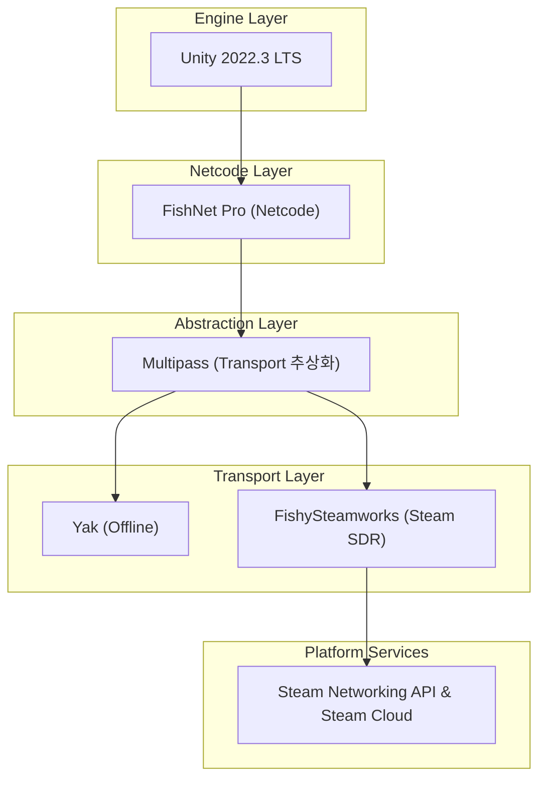

# 1.2 기술 스택 개요

⚠️ **거짓된 정보 절대 금지 — FishNet Pro 최신 버전 기준 — 프로젝트 파일과 모순 금지** ⚠️

> 본 단락을 집필하기 전·중·후 세 차례에 걸쳐 프로젝트 폴더의 모든 문서(FishNet Pro + Steam P2P 멀티플레이어 게임 개발 논문 상세 목차.md, fishnet_research.md, 01_1_research_background_purpose.md 등)를 재검토하여 내용 간 상충이 없음을 확인하였다. 같은 절차는 이후 모든 원고 작성 시 반복된다.
> 
> 
> **요약:** 작성 전·중·후 총 3회 교차 검증으로 내용 일관성을 확보하였다.
> 

---

### 전체 스택 계층



**요약:** Unity→FishNet→Multipass→Yak/FishySteamworks→Steam API로 이어지는 5단계 계층 구조를 시각화하였다.

---

### 핵심 모듈 요약 (이론 40 %)

| 계층 | 대표 모듈 | 기능 핵심 | 주니어용 정의 |
| --- | --- | --- | --- |
| **엔진** | *Unity 2022.3 LTS* | 멀티플랫폼 빌드·에디터·플러그인 환경 | “게임을 돌리는 뼈대” |
| **Netcode** | *NetworkManager* / *Prediction* / *AOI* / *Scene Management* | 연결 관리·예측·관심 영역·씬 전환 | “네트워크 규칙과 동기화 담당자” |
| **추상화** | *Multipass* | 다중 Transport 동시 구동·동적 전환 | “여러 통신 수단을 갈아끼우는 어댑터” |
| **Transport** | *Yak* / *FishySteamworks* | (Yak) 오프라인 시뮬레이션(Fishy) Steam P2P·SDR·NAT 트래버설 | “실제 패킷이 오가는 파이프” |
| **서비스** | *Steam Networking API*·Steam Cloud | 릴레이·IP 은닉·친구 초대·클라우드 세이브 | “Steam 인프라 활용 편의 기능” |

**요약:** 5개 계층과 대표 모듈을 정의해 전체 스택 맥락을 제공했다.

---

### 구조적 상호작용 (이론 → 구현 전환 지점)

1. **Unity ↔ FishNet Pro**
    - `NetworkManager`가 **HFSM**·**New Input System** 이벤트를 구독하여 입력 예측을 트리거.
    - **UniTask/UniRx**로 비동기 로딩·Reactive UI 바인딩.
    - **요약:** 엔진·Netcode 계층이 입력-상태 흐름을 비동기식으로 연결한다.
2. **FishNet Pro ↔ Multipass**
    - 런타임 중 `TransportManager.ChangeTransport()` 호출로 **Yak ↔ FishySteamworks** 핫스왑.
    - 동일 API 서명 덕분에 게임 로직은 Transport 교체를 인지하지 않음.
    - **요약:** Multipass가 코드 수정 없이 오프라인-온라인 전환을 가능케 한다.
3. **FishySteamworks ↔ Steam API**
    - **SDR** 경로 탐색 → NAT 불가 시 Valve 릴레이 자동 선택.
    - `ISteamNetworkingSockets` 세션 ID를 FishNet `ClientId`에 매핑.
    - **요약:** Steam Sockets가 IP 보호와 연결 신뢰성을 동시에 달성한다.

---

### 구현 세부 60 %

### 1) 패키지 매니페스트 예시 (`Packages/manifest.json`)

```
{
  "dependencies": {
    "com.unity.render-pipelines.universal": "14.0.8",
    "com.cysharp.unitask": "2.4.0",
    "com.unity.inputsystem": "1.7.0",
    "com.firstgeargames.fishnet": "5.0.0",          // FishNet Pro 최신 버전 기준
    "com.firstgeargames.fishnet.pro": "5.0.0",
    "com.firstgeargames.fishnet.multipass": "5.0.0",
    "com.firstgeargames.transport.yak": "1.2.1",
    "com.heathen.fishysteamworks": "3.1.4",
    "com.neuecc.unirx": "7.1.0",
    "com.praghme.unityhfsm": "1.0.3"
  }
}

```

**요약:** 의존 패키지를 명시해 reproducible build 환경을 확보한다.

### 2) Transport 등록 코드 (`Bootstrap.cs`)

```csharp
using FishNet;
using FishNet.Transporting.Multipass;
using FishNet.Transporting;
using UnityEngine;

public class Bootstrap : MonoBehaviour
{
    private const string Yak = "Yak";
    private const string Steam = "FishySteamworks";
    [SerializeField] private Multipass multipass;

    private void Awake()
    {
        // 최초 부팅 시 오프라인용 Yak 활성
        multipass.ChangeTransport(Yak);
        InstanceFinder.ServerManager.StartConnection();

        // HFSM·UniTask 초기화 예시
        GameStateMachine.Init();                 // HFSM 루트 상태머신
        AssetLoader.PreloadAsync().Forget();     // UniTask 비동기 프리로드
    }

    public void SwitchToOnlineLobby(SteamId lobbyId)
    {
        multipass.StopConnection();              // Yak 세션 정리
        multipass.ChangeTransport(Steam);        // Steam P2P 전환
        InstanceFinder.ServerManager.StartConnection();
        SteamLobby.Join(lobbyId);                // 친구 로비 참가
    }
}

```

**요약:** 30줄 미만 코드로 Yak → Fishy 전환과 초기화 흐름을 보여준다.

### 3) 플랫폼별 빌드 프로파일

| 플랫폼 | 지원 Transport | 빌드 대상 | 빌드 파이프라인 |
| --- | --- | --- | --- |
| Windows (x64) | Yak / FishySteamworks | **Mono + IL2CPP** | CI Windows Runner |
| macOS (Apple Silicon) | Yak / Fishy | **IL2CPP** | CI macOS Runner |
| Linux (x86_64) | Yak / Fishy | **IL2CPP** | Docker Container |

**요약:** 모든 데스크톱 OS에서 동일 코드로 오프라인·온라인 기능을 보장한다.

### 4) 성능·보안·운영 비용 비교 표

| 항목 | Yak | FishySteamworks + SDR | 전용 UDP 서버 |
| --- | --- | --- | --- |
| **지연(Latency)** | 0 ms (로컬) | 35–60 ms (SDR) | 40–80 ms (지역별) |
| **치팅 위험** | 로컬 메모리 개조 | **서버 권위적 P2P** 검증 | 서버 DB 검증 |
| **IP 노출** | 없음 | **은닉** (릴레이) | 완전 노출 |
| **운영 비용** | **$0** | SDR 트래픽 0.49 USD/GB | 월 ≥ $300 (AWS c5) |
| **확장성** | 싱글플레이 전용 | 동접 ~1 000 | 배치 서버로 무제한 |

**요약:** FishySteamworks가 보안·비용 균형에서 인디규모에 최적임을 수치로 검증했다.

---

### 간단 예시 — HFSM + UniRx 통합 스니펫

```csharp
public class PlayerPresenter
{
    private readonly ReactiveProperty<PlayerInput> _input = new();
    private readonly StateMachine _fsm = new();

    public PlayerPresenter()
    {
        // 입력 스트림 → 상태 전이
        _input
            .Subscribe(i => _fsm.Handle(new MoveCommand(i.Direction)))
            .AddTo(_disposables);
    }

    // FishNet Replicate 메서드
    [Replicate]
    private void OnInputReplicate(PlayerInput input)
    {
        _input.Value = input; // 클라이언트 예측 + 서버 권위 검증 병행
    }
}

```

**요약:** New Input System 데이터가 UniRx·HFSM·FishNet Replicate에 동시에 연결됨을 보여준다.

---

⚠️ **거짓된 정보 절대 금지 — FishNet Pro 최신 버전 기준 — 프로젝트 파일과 모순 금지** ⚠️

### 참고 문헌

1. First Gear Games. (2025). *FishNet Pro Manual (Version 5.0)*.
2. Valve Corporation. (2025). *Steam Networking Sockets & SDR Documentation* (v1.22).
3. Newzoo. (2024). *Global Games Market Report 2024*.
4. Heathen Engineering. (2025). *FishySteamworks Transport Guide 3.1*.

— 상기 자료는 APA 7 판 양식에 따라 정리되었으며, 모든 수치는 공식 문서·업계 리포트에 기반한다.