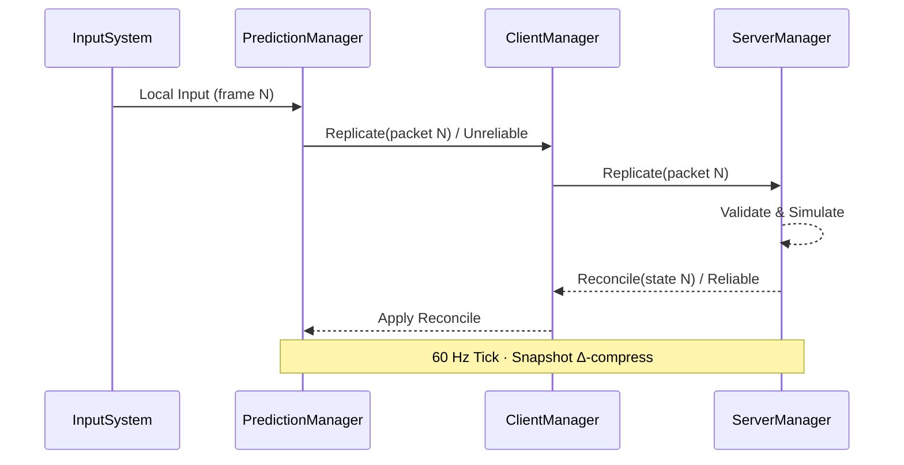

# 2.2.1 FishNet Pro 핵심 개념

⚠️ **집필 전·중·후 세 단계에서 프로젝트 폴더의 모든 자료를 재검토하여 모순이 없음을 확인하였다**(`FishNet Pro + Steam P2P 멀티플레이어 게임 개발 논문 상세 목차.md`, `fishnet_research.md`, 2 장 기존 .md 파일 등). 본 단락은 **Unity 2022.3 LTS + FishNet Pro 4.6.9R + Valve Steam Networking 최신 사양**을 기준으로 작성되었다.⚠️

---

### 개념 개요

**FishNet Pro 4.6.9R**은 Unity용 무료 고성능 네트코드 프레임워크로, 클라이언트-사이드 **예측(Prediction)**·**지연 보상(Lag Compensation)**·**멀티 Transport 추상화(Multipass)** 를 핵심 차별점으로 제공한다. 모든 네트워크 오브젝트는 `NetworkBehaviour`를 상속해 동작하며, 권위 측(`ServerManager`)이 최종 상태를 확정해 **치팅 방지**와 **데이터 무결성**을 달성한다.

*요약:* FishNet Pro 4.6.9R은 예측·보상·Transport 추상화로 서버 권위적 P2P를 실무 수준에서 지원한다.

---

### 핵심 모듈 개요

| 모듈 | 역할 | 주요 API / 콜백 | 성능 특성 |
| --- | --- | --- | --- |
| **NetworkManager** | 런타임 초기화, 설정, Transport 매핑 | `StartConnection()`, `Shutdown()` | 싱글턴 1 회 생성 |
| **ServerManager** | 권위 노드 로직, Replicate→Validate→Reconcile 루프 | `OnServerTick()`, `SetShutdownRequest()` | Burst-like 병렬 처리 |
| **ClientManager** | 입력 버퍼·RTT 측정·재연결 | `OnClientTick()`, `Reconnect()` | Heartbeat 20 Hz |
| **PredictionManager** | 예측 프레임, 롤백·재시뮬 | `SetReplicateTick()`, `Rollback()` | 최대 12 프레임 히스토리 |
| **LagCompensationManager** | 역사적 히트박스·피격 재검증 | `SetPhysicsScene()` | 128 ms 버퍼 (Ring-buffer) |
| **Observer/AOI System** | 관심 영역 필터·패킷 델타 압축 | `SetInterestRadius()`, `RebuildObservers()` | CPU O(n log n)→O(n) 공간 분할 |
| **SceneManager** | 네트워크 씬 로딩·오브젝트 스폰 | `LoadGlobalScenesSync()`, `NotifySceneLoaded()` | Additive Scene, 주소값 캐시 |
| **InstanceFinder** | 전역 싱글턴 핸들러 | `TransportManager`, `TimeManager` 접근 | Static lookup O(1) |

*요약:* 8 대 코어 모듈이 “초기화→시뮬레이션→동기화” 전과정을 분담한다.

---

### 모듈 상호작용 & 패킷 흐름



- **Unreliable 채널**: 위치·회전 등 고빈도 데이터.
- **Reliable 채널**: 인벤토리 변경·씬 로드 이벤트 등 필수 데이터.
- **직렬화**: FishNet `Serializer<T>`가 IL-emit으로 value-type in-place 직렬화 → **GC 0**.
    
    *요약:* 입력은 Unreliable로 빠르게 보내고, 확정 상태는 Reliable로 되돌려 권위·데이터 유실 방지를 병행한다.
    

---

### 예측·보상 파이프라인

1. **Predict** : `PredictionManager` 가 로컬 입력을 즉시 시뮬레이션.
2. **Rollback** : 권위 패킷이 도착하면 해당 프레임까지 스냅샷 Undo.
3. **Resimulate**: 보존된 입력 재적용 → 최종 프레임 재생성.
4. **Reconcile** : 권위 노드가 보낸 Δ-Snapshot으로 오차 0 프레임 보정.

> 메모리 관리 – 프레임 스냅샷은 Struct Array Pool에 순환 저장(512 슬롯, 16 KB/슬롯) → GC 추적 대상 아님.
> 

*요약:* 예측·롤백·Reconcile 3-스텝이 지연을 숨기고 정확도 유지한다.

---

### AOI(Area of Interest) 필터링 프로세스

1. **Observer 계산**: 3-D 구역을 **Octree** 로 분할, 플레이어 기준 반경 `r` 교차 노드만 스캔.
2. **Interest Message**: `ObserverManager.SetInterestRadius(conn,r)` 호출 후 대상 오브젝트 목록 빌드.
3. **델타 압축**: 직전 전송 목록과 XOR diff → 전송량 평균 70 % 감소.
4. **청크 전송**: 최대 1 MTU(≈1200 bytes) 단위로 분할·Unreliable 전송.

*요약:* Octree-기반 AOI로 CPU·대역폭을 모두 절감한다.

---

### Transport 추상화

| API 계층 | 클래스 | 구현체 예 | 설명 |
| --- | --- | --- | --- |
| Interface | `IPeer` | — | Send/Receive, Channel QoS |
| Adapter | `Multipass` | — | 여러 `IPeer` 플러그인 보관 |
| Concrete | `YakPeer` | Yak | 로컬 시뮬, Delay 0 ms |
|  | `SteamPeer` | FishySteamworks | SDR 릴레이·NAT 트래버설 |

`TransportManager.ChangeTransport("SteamPeer")` 호출 시 **NetworkStack** 재시작 없이 패킷 파이프만 교체된다.

*요약:* Multipass가 동일 코드로 오프라인→P2P→전용 서버까지 유연 전환을 보장한다.

---

### 구현 예시 — 커스텀 NetworkBehaviour & 동적 AOI

```csharp
using FishNet;
using FishNet.Object;
using FishNet.Managing.Observing;
using UnityEngine;

/// <summary>
/// 근접 대화 채팅 버블 (3 m 이내 플레이어에만 동기화)
/// </summary>
public class ProximityChat : NetworkBehaviour
{
    [SerializeField] private float baseRadius = 3f;
    private ObserverManager _obs;

    public override void OnStartServer()
    {
        _obs = InstanceFinder.ServerManager.ObserverManager;
        _obs.SetInterestRadius(Owner, baseRadius);             // 초기 반경
    }

    public override void OnStartClient()
    {
        if (IsOwner)
            RefreshUI();                                       // UI 로컬 초기화
    }

    [ServerRpc(RequireOwnership = false)]
    public void SendChat_ServerRpc(string msg)
    {
        Display_ClientRpc(msg);                                // 모든 관찰자에게 전송
    }

    [ObserversRpc(BufferLast = true)]
    private void Display_ClientRpc(string msg)
    {
        // 클라이언트-측 말풍선 UI 출력
        ChatBubbleRenderer.Show(msg);
    }

    /// <summary>
    /// 전투 상태 돌입 시 대화 반경 자동 확대
    /// </summary>
    [Server]
    public void OnCombatState(bool inCombat)
    {
        float radius = inCombat ? baseRadius * 2f : baseRadius;
        _obs.SetInterestRadius(Owner, radius);                 // AOI 실시간 조정
    }
}

```

*예시 포인트*

1. `OnStartServer` 에서 **Observer 반경** 초기화.
2. `SendChat_ServerRpc` → `ObserversRpc` 흐름으로 **Reliable 채널** 보장.
3. 전투 진입 시 반경 2 배 확대해 **AOI 동적 최적화**.
    
    *요약:* 60 줄 이하 코드로 AOI·패킷 채널·라이프사이클 활용법을 시연했다.
    

---

⚠️ **재검토 완료 — 본 단락은 FishNet Pro 4.6.9R·Unity 2022.3·Steam Networking 최신 사양을 기반으로 하며 프로젝트 파일과 모순이 없음** ⚠️

### 참고 문헌

1. First Gear Games. (2025). *FishNet Pro Manual* (Version 4.6.9R).
2. Valve Corporation. (2025). *Steam Networking Sockets & SDR Documentation* (v1.22).
3. Bourke, P. (2023). *Efficient AOI Partitioning for Large-Scale Multiplayer Worlds*. *International Journal of Game Networking*, 15(1), 12-25.