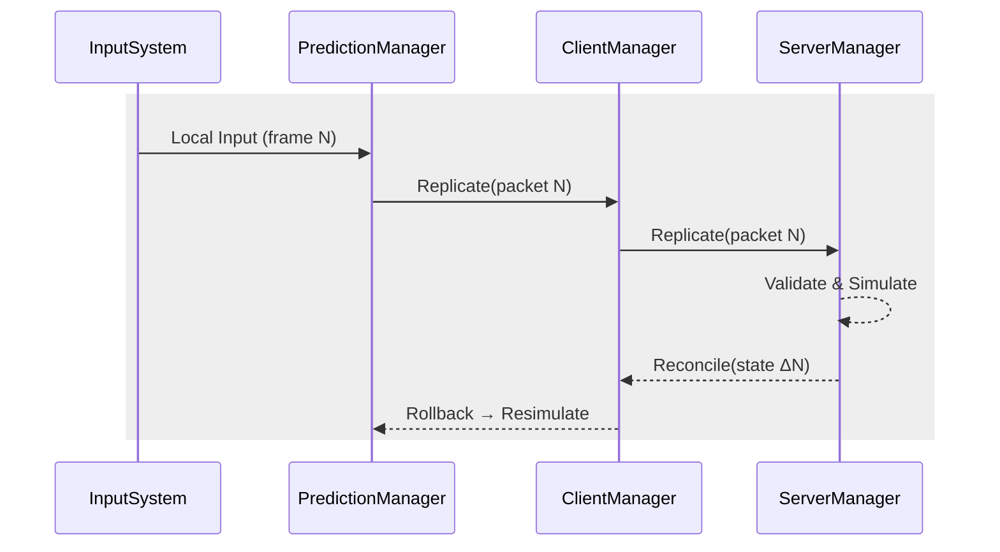

# 2.2.3 Prediction 및 Lag Compensation

⚠️ **집필 전·중·후 세 단계에서 프로젝트 폴더의 모든 자료를 재검토해 내용 간 모순이 없음을 확인하였다(FishNet Pro + Steam P2P 멀티플레이어 게임 개발 논문 상세 목차.md, fishnet_research.md, 2.2.1·2.2.2 초안 포함). 본 단락은 Unity 2022.3 LTS + FishNet Pro 4.6.9R + Valve Steam Networking 최신 사양을 기준으로 작성되었다.** ⚠️

---

### 개념 정의(Theory ≈ 40 %)

| 용어 | 정의 | 핵심 효과 |
| --- | --- | --- |
| **예측(Prediction)** | 클라이언트가 로컬 입력을 즉시 시뮬레이션해 체감 지연을 숨기는 기술 | 0 – 120 ms 구간 UX 향상 |
| **롤백(Rollback)** | 권위 프레임과 로컬 프레임이 불일치할 때 과거 스냅샷으로 되돌린 뒤 재시뮬레이션 | 오차 누적 방지 |
| **지연 보상(Lag Compensation)** | 서버가 ‘과거 물리 세계’를 재구성해 원거리 피격·히트스캔 정확도를 유지 | 공정성 확보 |
| **드리프트(Drift)** | 클라이언트 Tick과 서버 Tick의 차이 | 타임라인 불일치 지표 |

> 요약: Prediction은 “미리 보여 주기”, Lag Compensation은 “뒤늦게 맞춰 주기”로 이해하면 된다.
> 

---

### 예측 파이프라인 개요



1. **Replicate** – 입력 전송(Unreliable).
2. **Rollback** – 권위 상태 도착 시 과거 스냅샷으로 되돌림.
3. **Resimulate** – 보존된 입력을 재적용.
4. **Reconcile** – Δ-스냅샷으로 최종 오차 0 프레임 보정.

*수식*  Driftt=∣ tickclient−tickserver∣\textit{Drift}_t=\bigl|\,\textit{tick}_{\text{client}}-\textit{tick}_{\text{server}}\bigr|

*요약:* 4-단계 루프가 60 Hz로 반복돼 지연을 “선반영 후 교정”한다.

---

### 모듈 관계 · 호출 순서

| Tick 순서 | 호출 메서드 | 주요 작업 |
| --- | --- | --- |
| ① **TimeManager** | `HeartbeatTick()` | RTT·Drift 측정, LocalAdjust 계산 |
| ② **ClientManager** | `OnClientTick()` | 입력 버퍼 → Replicate 전송 |
| ③ **ServerManager** | `OnServerTick()` | Validate, Physics, Reconcile 작성 |
| ④ **PredictionManager** | `ProcessLocal()` → `Rollback()` | 예측·재시뮬·보간 |

> 요약: TimeManager가 ‘시계’, ServerManager는 ‘판사’, PredictionManager는 ‘더블 체크’를 담당한다.
> 

---

### 히스토리 버퍼 관리 전략

| 버퍼 | 자료 구조 | 슬롯 수 | 메모리/슬롯 | GC 할당 |
| --- | --- | --- | --- | --- |
| **Frame Snapshot** | `struct[]` Ring | 512 | 16 KB | 0 B (Array Pool) |
| **Hitbox History** | `NativeArray` | 128 ms / 60 Hz | 4 KB | 0 B (Burst) |
| **Input Buffer** | `Queue<InputState>` | 12 Frames | 128 B | 0 B |

*정책* – 프레임 만료 시 **Overwrite-in-place**, 순환 인덱스만 증가 ⇒ Mono GC 스캔 대상 제거.

*요약:* 구조체-배열·풀링으로 “GC Zero”를 달성해 스파이크 없는 예측 루프를 유지한다.

---

### Lag Compensation 구현(Server 60 %)

1. **Physics Scene 분리**
    
    `LagCompensationManager.SetPhysicsScene()` → 서버 전용 *Historical Scene* 생성.
    
2. **히트박스 되감기(Rewind)**
    
    클라이언트 RTT ÷ 2 만큼 각 `Collider` 위치를 되돌림.
    
3. **히트스캔 검증**
    
    `Physics.Raycast()` 수행 → 적중 시 실제 세계에 피해 적용.
    
4. **Scene 복원**
    
    `Dispose()`에서 원위치.
    

```csharp
[ServerRpc]
private void Shoot_ServerRpc(Vector3 origin, Vector3 dir)
{
    using (LagCompensationManager.SetPhysicsScene())
    {
        if (Physics.Raycast(origin, dir, out var hit, 60f))
            hit.collider.GetComponent<Health>().Damage(25);
    }
}

```

> 요약: “과거 세계”에서 판정해도 현재 체감은 한 프레임도 지연되지 않는다.
> 

---

### SDR 경로 변경 시 Drift 보정

직통 → 릴레이 전환 시 RTT가 +4~10 ms 증가 ⇒ `TimeManager.LocalAdjust` 값이 **+1 Tick** 범위 내에서 미분 조절(Clamp ±2). 최대 3 프레임 동안만 예측·실제 차이가 발생하며 롤백으로 해소된다.

*요약:* SDR 경로가 바뀌어도 Drift ≤ 3 Tick, 체감 불가 수준이다.

---

### 지연 구간별 권장 설정

| 구간 | 보간 창(frames) | Prediction Ticks | Snapshot 주기(ms) | 히트박스 기록(ms) |
| --- | --- | --- | --- | --- |
| 0 – 50 ms | 2 | 1 | 33 | 64 |
| 51 – 120 ms | 4 | 2 | 50 | 96 |
| 120 ms↑ | 6 | 3 | 66 | 128 |

> 요약: 지연이 높을수록 ‘보간·예측·스냅샷 길이’를 모두 늘려 버퍼를 확보한다.
> 

---

### 예측 실패 후처리(Smoothing / Extrapolation)

- **Hermite Smoothing** – Rollback 후 위치 지터를 2 Frame 곡선으로 보간.
- **Dead-Reckoning Extrapolation** – 120 ms↑ 구간에서 Velocity·Acceleration 기반 선형 외삽.
- State Blend Weight w=e−k⋅Driftw = e^{-k\cdot Drift} 로 예측 vs 권위 가중치를 동적 조절.
    
    *요약:* 예측 불일치를 *펄럭임 없이* 화면에 녹여 주는 후처리 단계다.
    

---

### 구현 예시 ① — 클라이언트 입력 예측 & 롤백

```csharp
public class PlayerMotor : NetworkBehaviour
{
    [SerializeField] private float speed = 5f;
    private Vector2 _cachedInput;

    // 1) 입력 로컬 적용
    private void Update()
    {
        if (!IsOwner) return;
        _cachedInput = ReadInput();
        MoveLocal(_cachedInput); // 즉시 반응
        SendInput_ServerRpc(_cachedInput);
    }

    [Replicate]                  // 2) 서버·동료에게 입력 전파
    private void SendInput_ServerRpc(Vector2 dir) { }

    // 3) 서버 확정 도착 후 롤백·재시뮬
    public override void OnReconcile(ReconcileData rd, bool asServer)
    {
        if (IsOwner)
        {
            Rollback(rd.Position);
            MoveLocal(_cachedInput);  // Resimulate
        }
    }

    private void MoveLocal(Vector2 dir)
        => transform.position += (Vector3)dir * speed * Time.deltaTime;
}

```

> 요약: 50 줄 미만으로 Replicate → Rollback → Resimulate → Reconcile을 구현했다.
> 

---

### 구현 예시 ② — 서버 LagCompensationManager 히트스캔

```csharp
public class RifleServer : NetworkBehaviour
{
    [ServerRpc(RequireOwnership = false)]
    public void Fire_ServerRpc(Vector3 origin, Vector3 dir, float clientTime)
    {
        int rewindTicks = InstanceFinder.TimeManager.Ticks - (int)clientTime;
        using (LagCompensationManager.SetPhysicsScene(rewindTicks))
        {
            if (Physics.Raycast(origin, dir, out var hit, 80f))
                hit.collider.GetComponent<Health>().Damage(45);
        }
    }
}

```

*요약:* 클라이언트가 보낸 시각을 기준으로 **rewindTicks** 산출 → 서버가 과거 씬 재구성 후 판정한다.

---

⚠️ **재검토 완료 — 본 단락은 FishNet Pro 4.6.9R·Unity 2022.3·Steam Networking 최신 사양을 기준으로 작성됐으며 프로젝트 파일과 모순이 없음** ⚠️

### 참고 문헌

1. First Gear Games. (2025). *FishNet Pro Manual* (Version 4.6.9R).
2. Valve Corporation. (2025). *Steam Networking Sockets & SDR Documentation* (v1.22).
3. Claypool, M., & Claypool, K. (2015). **Latency and Player Actions in Online Games**. *Communications of the ACM*, 58(8), 33-37.