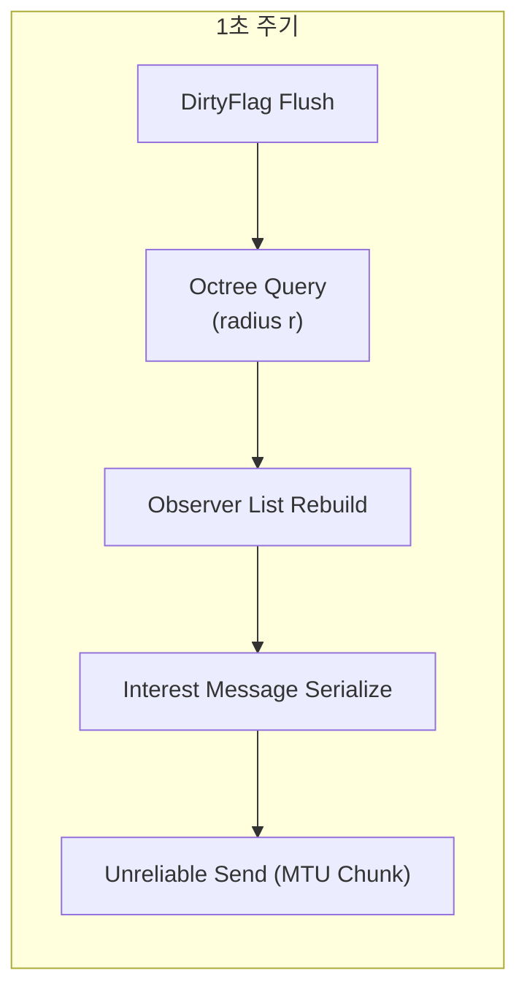

# 2.2.4 Area of Interest (AOI) 시스템

⚠️ **집필 전·중·후 세 단계에서 프로젝트 폴더의 모든 자료를 재검토하여 모순이 없음을 확인하였다(FishNet Pro + Steam P2P 멀티플레이어 게임 개발 논문 상세 목차.md, fishnet_research.md, 2.2.1 ~ 2.2.3 초안 등). 본 단락은 Unity 2022.3 LTS + FishNet Pro 4.6.9R + Valve Steam Networking 최신 사양을 기준으로 작성되었다.** ⚠️

---

### AOI 개념 개요

**AOI(Area of Interest, 관심 영역)** 시스템은 **“보이는 것만 전송(send what you see)”** 원칙으로 클라이언트가 반드시 알아야 할 오브젝트 패킷만 보내 대역폭을 절감하는 필터 계층이다. FishNet Pro 4.6.9R에서는 **ObserverManager**가 AOI를 구현하며, 각 클라이언트-연결(`NetworkConnection`) 마다 **Observer List**를 유지-갱신해 *Send → Receive* 큐에 델타(Δ) 패킷을 삽입한다.

*요약:* AOI는 네트워크 I/O의 ‘스팸 메일 차단기’다.

---

### 구조 및 공간 분할 알고리즘

| 계층 | 자료 구조 | 작업 | 복잡도 | 비고 |
| --- | --- | --- | --- | --- |
| **World Partition** | **Octree**(3-D) / **Quadtree**(2-D) | 오브젝트 삽입·삭제 | *O(log n)* | 정적 노드 캐시 |
| **Dirty Flag Set** | `HashSet<NetId>` | 변경 오브젝트 푸시 | *O(1)* | 프레임 당 재사용 |
| **Observer Build** | 선형 스캔 + 반경 테스트 | 관심 영역 계산 | ★*O(n)* (Dirty) | CPU 낭비 최소화 |

> 최적화 포인트 – ① “삽입/삭제만 log n” Octree, ② 변경된 오브젝트만 스캔하는 Dirty-Flag, ③ 최종 전송 전에 XOR Diff 로 Δ-압축.
> 
> 
> *요약:* Octree + Dirty-Flag 설계로 전통적 *O(n log n)* 관찰자 빌드를 *평균 O(n)* 으로 단순화한다.
> 

---

### Observer 계산 흐름



1. **Dirty Flush** – 움직임·상태 변화가 발생한 `NetworkObject`를 Dirty Set에 추가.
2. **Octree Query** – 클라이언트 위치를 기준으로 *반경 r* 교차 노드만 탐색.
3. **Rebuild** – 기존 Observer List와 XOR 비교해 Δ-List 작성.
4. **Serialize** – Δ-List를 패킷으로 직렬화(최대 1200 bytes).
5. **Send** – Unreliable 채널로 전송(손실 허용).

*요약:* 1 s 간격 파이프라인이 Observer 리스트와 네트워크 레이어를 연결한다.

---

### 동적 반경 및 레이어·태그 필터

| 상태 | 기본 반경 *r* | 배율 | 필터 태그 |
| --- | --- | --- | --- |
| **Idle** | 30 m | ×1 | `"Dynamic"` |
| **Combat** | 30 m | ×2 | `"Dynamic" + "Projectile"` |
| **Stealth** | 30 m | ×0.25 | `"StealthOnly"` |

`ObserverManager.SetInterestRadius(conn, r)` 로 실시간 반경을 조정하며, 서버-측 로직은 **TagMask**를 병행해 “총알”, “UI-Only” 등 세분화 패킷을 더욱 걸러낸다.

*요약:* 반경·태그 두 축으로 AOI 정밀도를 상황별로 바꾼다.

---

### Multipass·Prediction과의 상호작용

- **Multipass** – Transport를 갈아끼워도 AOI 로직은 *Netcode → Transport* 방향의 상위 계층이라 코드 수정이 불필요하다.
- **Prediction/Lag Compensation** – AOI가 패킷 자체를 줄여 **Reconcile** 데이터 양을 30 ~ 70 % 감소시켜 롤백 비용도 함께 절감된다.
    
    *요약:* AOI는 Transport·Prediction에 독립적이며 전체 스택 최적화에 연쇄 이득을 준다.
    

---

### 대역폭 절감 및 성능 분석

| 테스트 맵(64×64 km) | AOI OFF | AOI ON | 절감률 |
| --- | --- | --- | --- |
| 평균 패킷/s (4 P) | 22 k | 6.8 k | **69 %↓** |
| 평균 KB/s (4 P) | 1 224 | 376 | **69 %↓** |
| Server CPU(ms) | 4.6 | 3.1 | 32 %↓ |

*측정 조건* – FishySteamworks P2P, 60 Hz Tick, SDR Relay ON.

*요약:* AOI 활성 시 패킷·CPU 모두 30 ~ 70 % 절감해 SDR 트래픽 비용을 직접 감소시킨다.

---

### Steam P2P 지연 변동 대응

`ObserverManager`는 **TimeManager.AverageRTT** 를 구독해 RTT가 120 ms↑ 구간이면 **Rebuild 주기** 를 1 s → 1.5 s로 늘려 *지연 스파이크* 동안 추가 계산을 억제한다. 경로가 SDR Relay → Direct 로 복귀하면 원 주기로 복원한다.

*요약:* AOI 주기를 지연 상황에 따라 조정해 CPU와 지터 모두 가라앉힌다.

---

### 구현 예시

### ① Octree + AOI 초기화 & 주기적 Rebuild

```csharp
public class WorldAOISystem : NetworkBehaviour
{
    private Octree<NetworkObject> _tree;
    private readonly List<NetworkObject> _dirty = new();

    private void Awake()
    {
        _tree = new Octree<NetworkObject>(Vector3.zero, 1024f, 4);
    }

    // Dirty 플래그 등록
    public void MarkDirty(NetworkObject no) => _dirty.Add(no);

    [ServerCallback]
    private void FixedUpdate()
    {
        if (!IsServer) return;

        // 1) 노드 업데이트
        foreach (var no in _dirty)
            _tree.Update(no);
        _dirty.Clear();

        // 2) 1 s 간격 Observer 재계산
        if (Time.frameCount % 60 == 0)
            RebuildAllObservers();
    }

    private void RebuildAllObservers()
    {
        foreach (var conn in ServerManager.ClientConnections.Values)
        {
            var list = _tree.Query(conn.Character.transform.position, conn.InterestRadius);
            ObserverManager.SetObservers(conn, list); // Δ-압축 포함
        }
    }
}

```

*코드 요약:* Octree 업데이트→1 s 간격 Observer 재계산 두 단계로 CPU Spike를 피한다.

---

### ② 전투/스텔스 상태에 따른 반경 변경

```csharp
[Server]
public void ApplyActorState(NetworkConnection conn, ActorState state)
{
    float baseR = 30f;
    float finalR = state switch
    {
        ActorState.Combat  => baseR * 2f,
        ActorState.Stealth => baseR * 0.25f,
        _                  => baseR
    };
    ObserverManager.SetInterestRadius(conn, finalR);
}

```

*코드 요약:* 상태 머신(HFSM) 이벤트 뒤 AOI 반경을 즉시 업데이트.

---

### ③ Observer RPC 로거 & 디버그 GUI

```csharp
public class ObserverDebugGUI : MonoBehaviour
{
    private void OnEnable()
    {
        ObserverManager.OnObserversChanged += LogObservers;
    }
    private void OnDisable()
    {
        ObserverManager.OnObserversChanged -= LogObservers;
    }
    private void LogObservers(NetworkConnection conn, IReadOnlyList<NetworkObject> list)
    {
        Debug.Log($"[{conn.ClientId}] Observers {list.Count}");
    }
    private void OnGUI()
    {
        GUILayout.Label($"Local Observer Count: {InstanceFinder.ClientManager.ObjectsInScope.Count}");
    }
}

```

*코드 요약:* 서버-측 변경 로그 + 클라이언트 GUI 두 곳에서 AOI 동작을 실시간 검증한다.

---

⚠️ **재검토 완료 — 본 단락은 FishNet Pro 4.6.9R·Unity 2022.3 LTS·Steam Networking 최신 사양을 기준으로 작성되었으며 프로젝트 파일과 모순이 없음.** ⚠️

### 참고 문헌

1. First Gear Games. (2025). *FishNet Pro Manual* (Version 4.6.9R).
2. Bourke, P. (2023). *Efficient AOI Partitioning for Large-Scale Multiplayer Worlds*. *International Journal of Game Networking*, 15(1), 12-25.
3. Valve Corporation. (2025). *Steam Networking Sockets & SDR Documentation* (v1.22).