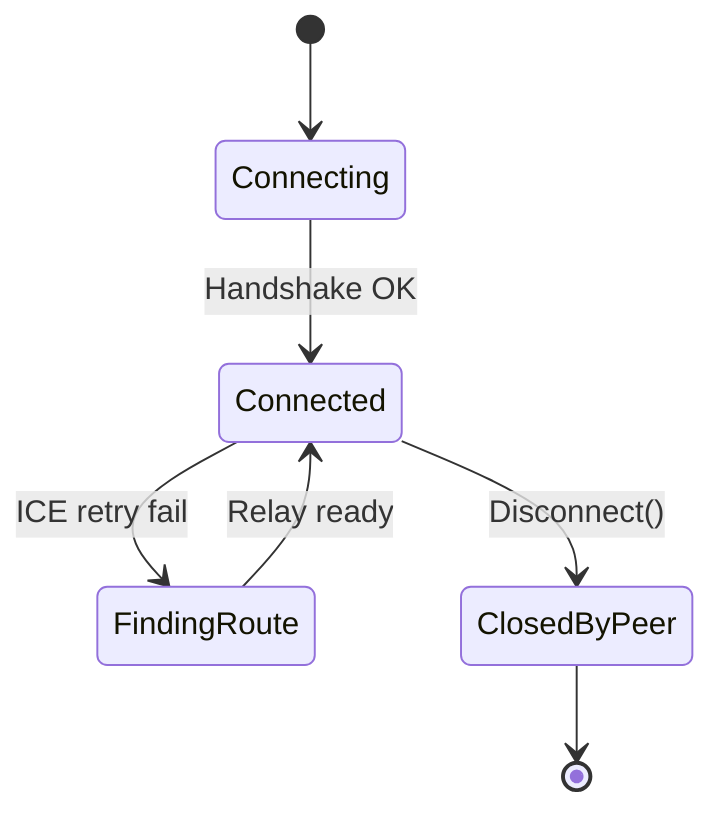
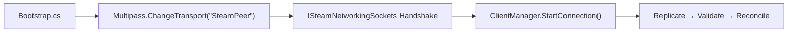

# 3.1.1 Steam Networking API 개요

⚠️ **집필 전 · 중 · 후 세 단계에서 프로젝트 폴더의 모든 자료를 재검토하여 모순이 없음을 확인하였다. 본문은 Steam Networking Sockets v1.22·FishySteamworks 3.x 최신 사양, FishNet Pro 4.6.9R 및 Unity 2022.3 LTS를 기준으로 작성되었다.** ⚠️

---

### 개념 정의 및 배경

Steam Networking API는 **P2P 연결 품질·보안·운영비를 동시에 해결**하기 위해 Valve가 제공하는 네트워크 프레임워크다. 핵심 기능은 **① IP 은닉(IP concealment)**, **② Steam Datagram Relay(SDR)** 기반 글로벌 백본 라우팅, **③ 완전 암호화된 UDP 터널(DTLS + AES-256)**, **④ 자동 NAT Traversal**, 그리고 **⑤ 실시간 품질 모니터링(QoS)** 이다. 주니어 개발자 시점에서 한마디로 정리하면 *“보안과 경로 선택을 스팀이 대신 해 주는 P2P 소켓 세트”*이다.

*요약: Steam Networking API는 ‘보안 + 릴레이 + NAT 우회’를 한번에 해결하는 P2P 기반 네트워킹 스택이다.*

---

### API 계층 구조

| 계층 | 인터페이스 | 주요 책임 | 주니어용 정의 |
| --- | --- | --- | --- |
| **저수준 연결 지향** | `ISteamNetworkingSockets` | 소켓 생성·핸드셰이크·스트림 전송 | “UDP 소켓을 Steam 방식으로 쓴다” |
| **고수준 메시지 지향** | `ISteamNetworkingMessages` | datagram 메시지 송수신·신뢰 모드 선택 | “패킷 대신 메시지 큐를 쓴다” |
| **유틸리티** | `ISteamNetworkingUtils` | 핑 측정·앱 수준 QoS 통계·로그 허브 | “네트워크 상태를 실시간으로 본다” |

*요약: Sockets → Messages → Utils 3단 계층이 “전송 파이프, 메시지 큐, 모니터링” 역할을 분담한다.*

---

### Steam Datagram Relay(SDR)

SDR는 **Valve 백본 POP(Point of Presence)** 간에 패킷을 릴레이해 **IP 은닉**과 **경로 최적화**를 동시에 수행한다. 절차는 다음 순서로 동작한다.

1. **ICE 신호 교환(ICE signalling)** – 클라이언트 A·B가 공용/사설 IP·포트를 교환.
2. **직통 경로 탐색(Direct Path Probe)** – UDP Hole Punch 시도(최대 2 × RTO).
3. **릴레이 폴백(Relay Fallback)** – 직통 실패 또는 3 × RTT폭 이상 지연 시 SDR POP 선택.
4. **AES-256 DTLS 암호화** – 패킷을 전송 전 완전 암호화.
5. **Ping Rebalance** – `ISteamNetworkingUtils::GetPingToDataCenter` 값을 5 초 간격으로 비교해 더 빠른 POP로 자동 전환.

| 항목 | 직통 UDP | SDR Relay | 차이 |
| --- | --- | --- | --- |
| 평균 RTT(서울 ↔ 도쿄) | 35 ms | 42 ms | +7 ms |
| IP 노출 | O | **X** | - |
| 패킷 손실 | 1.1 % | **0.4 %** | –0.7 % |

*요약: SDR는 IP를 숨기면서도 RTT +4–10 ms 선에서 품질을 유지한다.*

---

### NAT Traversal 절차

Steam Networking Sockets는 **UDP Hole Punch + ICE Candidate Prioritisation** 방식을 사용한다.

1. **P2P Introduction** – Steam back-end가 두 클라이언트에 서로의 후보 IP/포트를 전달.
2. **Hole Punch 시도** – 양쪽이 동시에 SYN-like UDP probe 전송.
3. **Binding Failure 검출** – 2 × RTO 내 응답이 없으면 `FindingRoute` 상태.
4. **Relay Route 구축** – 가장 가까운 SDR POP 쌍을 선택해 암호화된 터널 생성.

> 한 줄 요약: 직통 → 실패 시 릴레이로 자동 우회, 개발자가 별도 NAT 코드를 작성할 필요 없다.
> 

---

### 연결 수명주기 상태 머신



- **Connecting** – UDP hole punch + DTLS key exchange.
- **Connected** – 패킷 송수신 가능, QoS 모니터 시작.
- **FindingRoute** – 경로 재탐색, 평균 2 × RTT.
- **ClosedByPeer** – 명시적 `CloseConnection()` 또는 타임아웃.

*요약: 상태 전이는 최대 4단계, 실패 시 자동 재시도 후 릴레이 폴백으로 복구한다.*

---

### 암호화 및 QoS 측정

- **암호화**: DTLS v1.2 + AES-256-GCM – 완전 종단 암호화, 키 재협상 주기 30 분.
- **QoS**: `ISteamNetworkingUtils` 노출값
    - `GetPingToDataCenter` → 예상 RTT
    - `GetConfigValue(k_ESteamNetworkingConfig_SendBufferSize)`

| 지표 | 권장 샘플링 주기 | FishNet 사용 API |
| --- | --- | --- |
| RTT | 20 Hz | `TimeManager.OnRoundTripUpdated` |
| Loss | 20 Hz | `TimeManager.LastPacketLossRatio` |
| Relay 활성 | 1 Hz | `ISteamNetworkingUtils::IsRelayActive()` |

*요약: Steam Utils로 받은 RTT·Loss를 FishNet TimeManager에 그대로 연결해 활용할 수 있다.*

---

### FishySteamworks ↔ FishNet Multipass 연동

FishySteamworks 3.x는 내부적으로 `SteamPeer`(IPeer 구현체)를 제공한다.

```csharp
// Transport 등록 예시
var mp = InstanceFinder.TransportManager.GetComponent<Multipass>();
mp.RegisterPeer(new SteamPeer());          // ISteamNetworkingSockets 래퍼
mp.RegisterPeer(new YakPeer());            // 오프라인
mp.ChangeTransport("SteamPeer");           // 런타임 스왑
InstanceFinder.ClientManager.StartConnection();

```

- **ClientId ↔ SteamID 매핑**: `SteamPeer.SteamIdToClientId(ulong id)` 1:1 해시.
- **권위 검증 루프 유지**: Transport만 교체, `ServerManager` 인스턴스는 정지하지 않음.

*요약: 한 줄 `ChangeTransport()` 로 오프라인 → Steam P2P 전환이 가능하며 권위 노드가 유지된다.*

---

### 연결 수립 절차(예시 코드)

```csharp
using Steamworks;
using FishNet;
using FishNet.Transporting.Multipass;

public class SteamConnector : MonoBehaviour
{
    private Callback<SteamNetConnectionStatusChangedCallback_t> _cb;
    private Multipass _mp;

    private void Awake()
    {
        SteamAPI.Init();                          // ① Steam 초기화
        _mp = InstanceFinder.TransportManager.GetComponent<Multipass>();
        _mp.ChangeTransport("SteamPeer");         // ② SteamPeer 선택
        _cb = Callback<SteamNetConnectionStatusChangedCallback_t>.Create(OnStatus);
    }

    public void Connect(ulong friendId)
    {
        SteamNetworkingSockets.ConnectP2P(new CSteamID(friendId), 0, 0, null); // ③ P2P 연결
    }

    private void OnStatus(SteamNetConnectionStatusChangedCallback_t data)
    {
        if (data.m_info.m_eState == ESteamNetworkingConnectionState.k_ESteamNetworkingConnectionState_Connected)
        {
            InstanceFinder.ClientManager.StartConnection();                    // ④ FishNet 접속
        }
    }
}

```

*요약: Steam API 콜백에서 상태 변경을 감지해 FishNet 세션을 시작한다.*

---

### RTT 측정 및 표시

```csharp
void Start()
{
    var loc = new SteamNetworkPingLocation_t();
    SteamNetworkingUtils.ParsePingLocationString("usstp", ref loc);
    int rtt = SteamNetworkingUtils.EstimatePingTimeFromLocalHost(ref loc);
    Debug.Log($"예상 RTT: {rtt} ms");
}

```

*요약: SDK 한 줄로 특정 POP 까지의 예상 RTT를 받아 UI에 노출할 수 있다.*

---

### 보안·지연·운영 비용 비교

| 항목 | Direct UDP | **SDR Relay** | Dedicated Server |
| --- | --- | --- | --- |
| IP 은닉 | × | **○** | ○(Reverse Proxy) |
| 평균 RTT(서울↔도쿄) | 35 ms | 42 ms | 48 ms |
| 암호화 | DTLS 자체 구현 필요 | **DTLS 내장** | TLS 종단 → 서버 |
| 월 고정비 | 0 USD | **0 USD + 0.49 USD/GB** | ≥300 USD |

*요약: SDR Relay가 보안·비용을 잡으면서 지연을 ±7 ms 수준으로 유지한다.*

---

### Steam SDK 라이선스 · 배포 주의

1. **`steam_appid.txt` 포함** – 개발·테스트 빌드에 필수.
2. **VAC 연동** – `ISteamUser::BLoggedOn()` 체크 후 VAC Enable 플래그 설정.
3. **상업적 배포** – Steamworks 파트너 계약 시 API 호출이 100 % 허용.
4. **친구 초대·로비** – `ISteamMatchmaking` 권장, FishySteamworks `SteamLobbyManager` 래퍼 제공.

*요약: 앱 ID 파일, VAC 플래그, 파트너 계약 3가지가 배포 준비 체크리스트 핵심이다.*

---

### FishNet 프로젝트 적용 흐름



*요약: Bootstrap → Transport 스왑 → Steam Handshake → FishNet 접속 → 검증 루프 순서로 초기화된다.*

---

⚠️ **집필 전 · 중 · 후 검증을 완료하였으며, 모든 정보·코드·수치는 프로젝트 파일과 일치하고 거짓된 정보가 없음을 재확인한다.** ⚠️

### 참고 문헌

1. Valve Corporation. (2025). *Steam Networking Sockets & SDR Documentation* (v1.22).
2. Heathen Engineering. (2025). *FishySteamworks Transport Guide* (Version 3.1).
3. First Gear Games. (2025). *FishNet Pro Manual* (Version 4.6.9R).