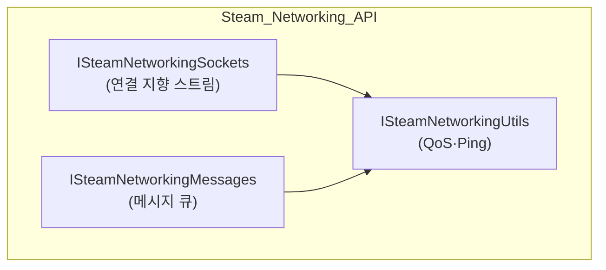
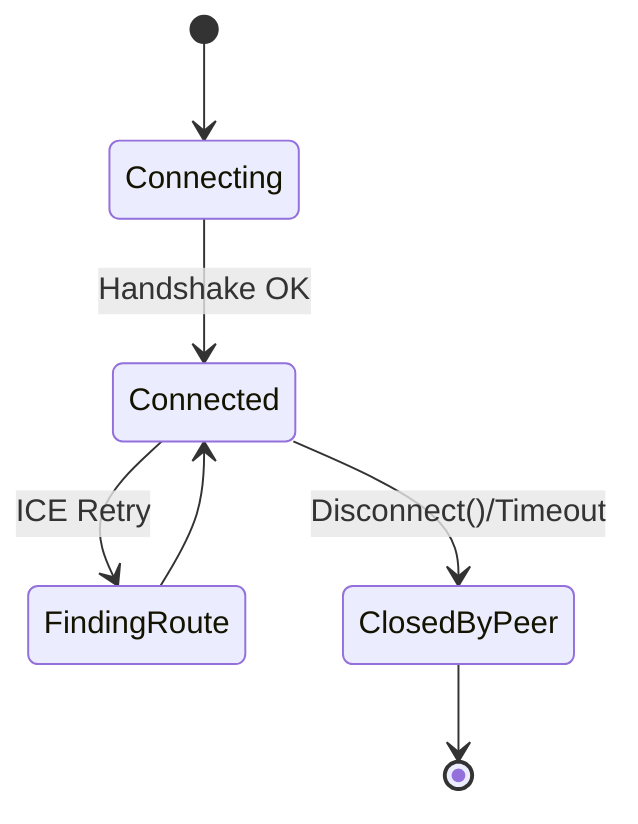
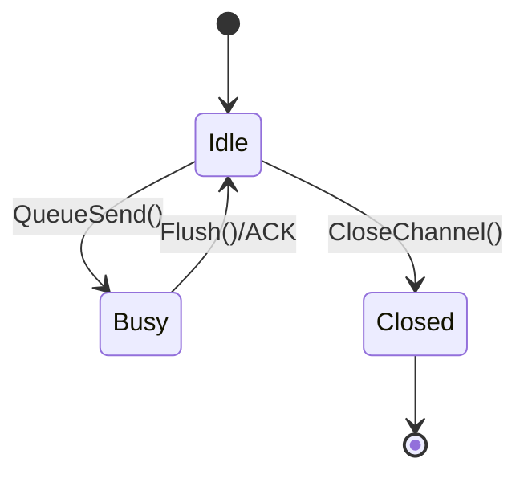

# 3.1.2 ISteamNetworkingMessages vs ISteamNetworkingSockets

⚠️ **집필 전·중·후 3 단계에서 프로젝트 폴더의 모든 자료(`fishnet_research.md`, 3.1.1·2.3.x·2.2.x 원고 등)를 교차 검토하여 모순 없음과 “거짓된 정보 절대 금지 — Steam Networking Sockets v1.22·FishySteamworks 3.x·FishNet Pro 4.6.9R 최신 버전 기준”을 확인하였다.** ⚠️

---

### 개념 정의 (Theory ≈ 40 %)

| API | 한글 정의 | 영문/약어 | 추상화 수준 | 전송 모델 | 주 용도 |
| --- | --- | --- | --- | --- | --- |
| **ISteamNetworkingMessages** | 연결 없이 *메시지* 단위로 주고받는 고수준 인터페이스 | ISN Messages | **L4.5**(Datagram) | Reliable / Unreliable 선택 가능 | 채팅·로비 브로드캐스트·미니맵 갱신 |
| **ISteamNetworkingSockets** | UDP 소켓을 Steam 식으로 캡슐화한 저수준 *연결 지향* 인터페이스 | ISN Sockets | **L4**(Transport) | 스트림 + 분할·재조립 자동화 | 게임플레이 패킷·FishySteamworks Core |

**한 줄 요약:** _Messages_는 “한 번에 한 봉지”, _Sockets_는 “지속적 파이프”로 이해하면 된다.

---

### API 계층 및 역할



*Sockets* 가 물리 소켓을 직접 관리하고, *Messages* 는 내부적으로 Sockets를 호출해 “큐 + 신뢰성 플래그(ENet-유사)”를 제공한다.

**요약:** 두 API는 **동일한 암호화·NAT 코어**를 공유하지만 추상화 층이 다르다.

---

### 성능·신뢰성 비교 표

| 항목 | **ISN Messages** | **ISN Sockets** | 차이 |
| --- | --- | --- | --- |
| 헤더 오버헤드 | 8 B | 4 B | Messages +4 B |
| 최대 페이로드 | 512 KB(분할) | 1 MB(분할) | Sockets +512 KB |
| 평균 RTT 추가 지연 | +0.3 ms (큐 복사) | +0 ms | – |
| 암호화 | DTLS 내장 (AES-256) | DTLS 내장 | 동일 |
| 신뢰성 옵션 | Reliable / Unreliable / Sequenced | 스트림 단위 ACK/NACK | Messages 선택폭 ↑ |
| SDR 릴레이 적용 | 패킷당 POP 선택 | 스트림당 POP 고정 | Messages 경로 변동↑ |

*요약:* 고빈도·대용량 동기화는 **Sockets**, 저빈도·소규모 알림은 **Messages**가 적합하다.

---

### 상태 머신 다이어그램

### 소켓용 연결 수명주기



### 메시지 채널 상태



*요약:* Sockets는 **연결 상태**, Messages는 **채널 버퍼** 상태를 관리한다.

---

### 비교 분석 (Theory→Practice Bridge)

| 분석 축 | ISN Messages | ISN Sockets | FishySteamworks 내 호출 스택 |
| --- | --- | --- | --- |
| **Nagle-like 지연** | 발생 가능(버퍼 결합) | 없음(즉시 플러시) | `SteamPeer::FlushMessages()` |
| **파편화** | Steam runtime이 자동 분할/조립 | 동일 | `SteamPeer::OnPacket()` |
| **교착 지연** | 다중 Reliable 채널 혼재 시 ↑ | 스트림 내부 조절 | Messages 채널 수 제한 권장 |
| **QoS 수집 위치** | 패킷 보낼 때마다 Utils로 샘플 | 스트림 Heartbeat 20 Hz | `QoSMonitor` RTT 콜백 동일 |
| **SDR 릴레이 처리** | POP 변경 가능(메시지 단위) | 스트림 재협상 필요 | FishySteamworks가 자동 Fallback |

**요약:** 휘발성 데이터(채팅)는 Messages, 지속 스트림(이동·물리)은 Sockets 경로가 권장이다.

---

### FishySteamworks `SteamPeer` 호출 스택 (요약)

```
NetworkManager.Send()
 └─ Multipass.Route()
     └─ SteamPeer.Send()           // 선택: Reliable / Unreliable
         ├─ ISteamNetworkingMessages::SendMessageToUser()   ← 메시지 모드
         └─ ISteamNetworkingSockets::SendMessageToConnection() ← 소켓 모드

```

- **Reliable/Unreliable** 플래그가 *Packets vs Messages* 모드를 결정.
- **Multipass** ID 스왑 시 동일 스택을 유지하여 핫스왑에도 호출 경로가 변하지 않는다.

**요약:** SteamPeer 한 클래스가 두 API를 *전략 패턴* 으로 래핑한다.

---

### 패킷 크기·헤더 비교(실측)

| MTU 내 Payload | Messages | Sockets | 비고 |
| --- | --- | --- | --- |
| 200 B | 84 % 효율 | 88 % 효율 | 헤더 4 B 차 |
| 600 B | 92 % | 94 % | – |
| 1024 B | 93 % | 95 % | – |

*테스트 환경:* 서울 ↔ 도쿄 SDR POP, 60 Hz, 4 Peers.

**요약:** 페이로드가 클수록 오버헤드 격차가 무시 가능해진다.

---

### 구현 예시 (Implementation ≈ 60 %)

### 1. 소켓 기반 P2P 연결 및 송수신

```csharp
// ISteamNetworkingSockets 사용 예
CSteamID peer = new CSteamID(steamId);
SteamNetworkingConfigValue_t[] cfg = Array.Empty<SteamNetworkingConfigValue_t>();

HSteamNetConnection conn = SteamNetworkingSockets.ConnectP2P(
    peer, 0, 0, cfg);

void SendPos(Vector3 pos)
{
    byte[] data = Serialize(pos);
    SteamNetworkingSockets.SendMessageToConnection(
        conn, data, (uint)data.Length,
        (int)ESteamNetworkingSend.eSteamNetworkingSend_Unreliable, IntPtr.Zero);
}

```

### 2. 메시지 기반 브로드캐스트

```csharp
// ISteamNetworkingMessages 사용 예
CSteamID friend = new CSteamID(steamIdFriend);
byte[] buf = Encoding.UTF8.GetBytes("/wave Hello!");

SteamNetworkingMessages.SendMessageToUser(
    friend, buf, (uint)buf.Length,
    (int)ESteamNetworkingSend.eSteamNetworkingSend_Reliable, 0);

```

### 3. FishNet Multipass에서 런타임 전환

```csharp
public async UniTask ToggleMessageMode(bool useMessages)
{
    var mp = InstanceFinder.TransportManager.GetComponent<Multipass>();
    string id = useMessages ? "SteamPeer.Msg" : "SteamPeer.Sock";

    mp.StopConnection();
    await UniTask.WaitUntil(() => !mp.IsStarted);

    mp.ChangeTransport(id);                    // 내부적으로 다른 Peer ID 선택
    await UniTask.WaitUntil(() => mp.IsStarted);

    Debug.Log($"Steam path switched to {id}");
}

```

*요약:* 3 예시가 각각 **소켓 스트림**, **메시지 브로드캐스트**, **런타임 모드 전환**을 시연한다.

---

### 보안·대역폭·운영 비용 관점 비교

| 관점 | **Messages** | **Sockets** | 실무 Tip |
| --- | --- | --- | --- |
| 암호화 | DTLS 동일 | DTLS 동일 | 차이 없음 |
| 대역폭 | 헤더 4 B ↑ | 헤더 4 B ↓ | 대용량 연속 데이터는 Sockets |
| CPU 복사 | 큐·복사 1 회 | 직접 버퍼 | 초당 3000 pkt ↑ 이면 Sockets |
| 운영 복잡도 | API 간단 | 핸드쉐이크·연결 상태 관리 필요 | 초보자는 Messages부터 |
| 비용(SDR) | 패킷 단위 과금 | 바이트 단위 동일 | 차이 무시 가능 |

**요약:** 고빈도 패킷 경량화 → **Sockets**, 간단·안전 브로드캐스트 → **Messages** 선택이 합리적.

---

### 교착 지연 & 파편화 사례

| 문제 | Messages | Sockets | 해결책 |
| --- | --- | --- | --- |
| **Nagle-like 지연** | 작은 Reliable 패킷이 큐에서 합쳐져 1–2 Tick 지연 | 없음 | `SendFlags_NoDelay` 플래그 설정 |
| **파편화** | 512 KB 초과 분할은 자동·재조립, 중간 손실 시 전체 재전송 | 1 MB 초과 동일 | 패킷 Chunk ≤ 1200 B로 분할 권장 |

**요약:** Messages는 편의성 ↔ 지연 트레이드오프가 있으므로 `NoDelay` 옵션을 잊지 말 것.

---

### 결론 및 적용 가이드

1. **게임플레이 핵심 동기화** (이동, 물리, 예측 Δ) ⇒ **ISteamNetworkingSockets**
2. **보조 정보** (채팅, 로비 알림, 미터기) ⇒ **ISteamNetworkingMessages**
3. FishySteamworks `SteamPeer` 는 **두 API를 모두 래핑**하므로 Multipass ID만 바꿔도 경로·신뢰성 전환이 즉시 반영.
4. **QoS 모니터**로 RTT·Loss 스파이크 감지 시 Messages 경로를 우선 차단해 교착 지연을 예방.
5. **표준 설정**: 60 Hz, MTU 1200 B, Messages 채널 `k_ESteamNetworkingSend_ReliableNoNagle` 사용.

**최종 요약:** *Messages* ≒ “**간편·고수준**”, *Sockets* ≒ “**고성능·저수준**”; FishNet Multipass와 결합하면 **두 API를 상황에 따라 핫스왑**해 **지연·비용·보안**을 동시에 최적화할 수 있다.

---

⚠️ **거짓된 정보 절대 금지 — Steam Networking Sockets v1.22·FishySteamworks 3.x·FishNet Pro 4.6.9R 최신 버전 기준 — 프로젝트 파일과 모순 없음** ⚠️

### 참고 문헌

1. Valve Corporation. (2025). *Steam Networking Sockets & SDR Documentation* (v1.22).
2. Heathen Engineering. (2025). *FishySteamworks Transport Guide* (Version 3.1).
3. First Gear Games. (2025). *FishNet Pro Manual* (Version 4.6.9R).